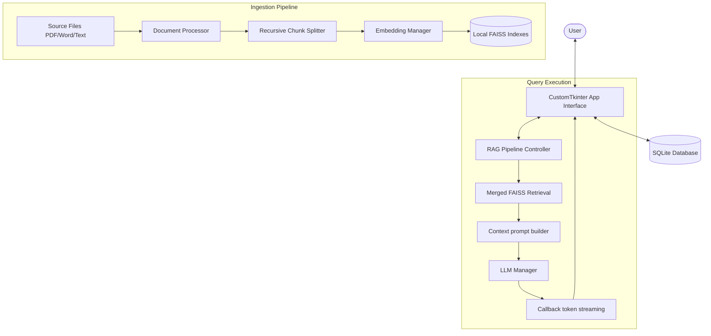
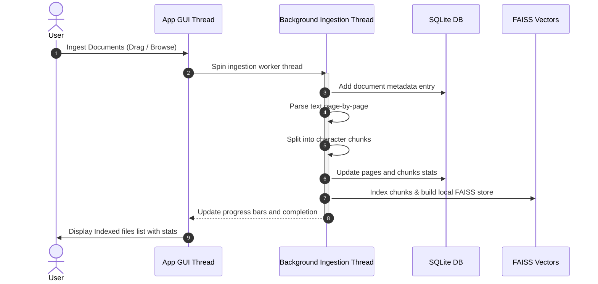
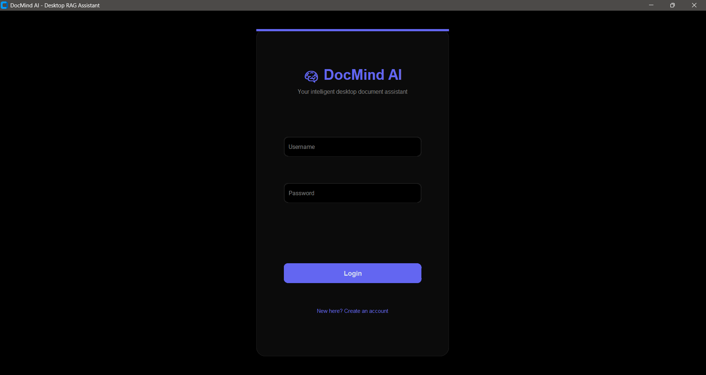
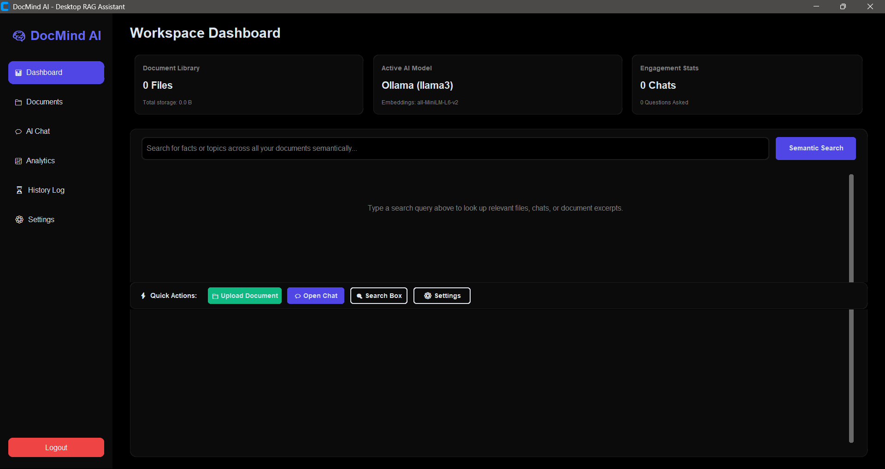
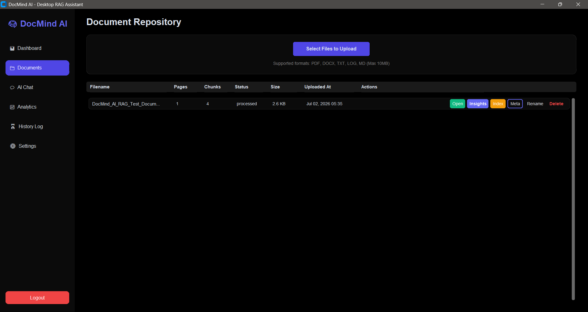
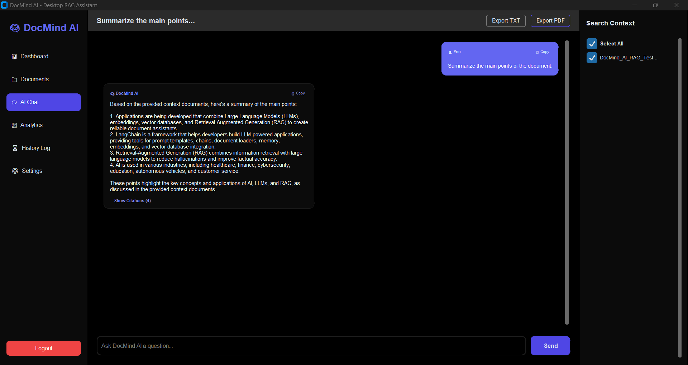
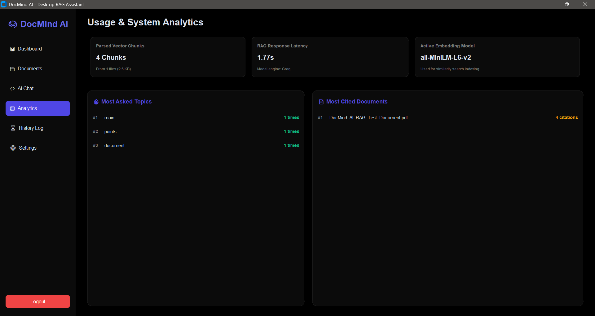
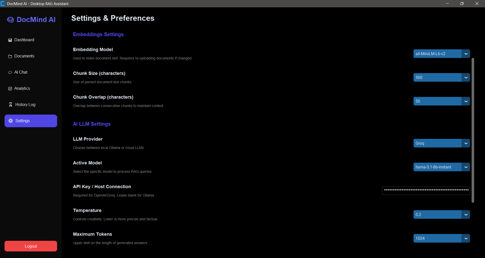

# DocMind AI - Desktop RAG Assistant

```text
========================================================================
  ██████╗  ██████╗  ██████╗███╗   ███╗██╗███╗   ██╗██████╗      █████╗ ██╗
  ██╔══██╗██╔═══██╗██╔════╝████╗ ████║██║████╗  ██║██╔══██╗    ██╔══██╗██║
  ██║  ██║██║   ██║██║     ██╔████╔██║██║██╔██╗ ██║██║  ██║    ███████║██║
  ██║  ██║██║   ██║██║     ██║╚██╔╝██║██║██║╚██╗██║██║  ██║    ██╔══██║██║
  ██████╔╝╚██████╔╝╚██████╗██║ ╚═╝ ██║██║██║ ╚████║██████╔╝    ██║  ██║██║
  ╚═════╝  ╚═════╝  ╚═════╝╚═╝     ╚═╝╚═╝╚═╝  ╚═══╝╚═════╝     ╚═╝  ╚═╝╚═╝
========================================================================
                   INTELLIGENT LOCAL & CLOUD RAG DESKTOP
```

## Overview
**DocMind AI** is an intelligent desktop application that lets you run local and cloud-based Retrieval-Augmented Generation (RAG) queries against your document libraries. Built entirely in Python using **CustomTkinter** for a premium responsive desktop interface, and **LangChain** + **FAISS** for search indexing, it represents a clean, modular assistant with advanced controls and detailed session analytics.

---

## Architecture
The application splits concerns across an Object-Oriented design separating UI views, DB management, model generation, and index retrieval.



---

## Workflow
All major computations (such as document indexing and LLM execution) run asynchronously in dedicated background threads to prevent UI freezes.



---

## Features

### 📊 Workspace Dashboard
- Real-time library stats: total document count, total parsed vector chunks, active LLM model engines, storage footprints, and engagement metrics.
- Unified **Global Semantic Search** looking up matching filenames, message history logs, and document snippets concurrently.
- Quick Actions bar to jump instantly to settings, uploads, or AI chat tabs.

### 📁 Advanced Document Repository
- View comprehensive document stats (file size, uploaded timestamp, parsing statuses, page count, and chunk splits).
- Perform individual actions: **Open** (with native OS default app), **Index** (re-index using new chunk constraints), **Meta** (inspect metadata card), **Rename**, and **Delete**.
- Unified **AI Insights** generation providing an executive summary, core keywords list, and suggested follow-up questions for any document.

### 💬 Asynchronous Streaming Chat
- Real-time token-by-token streaming with interactive **Stop Generation** control.
- Citation drawer for each response showing matching document page numbers, source texts, and similarity scores.
- Clickable citation headers that launch a **Built-in PDF Page Viewer** rendering the exact page source as a high-fidelity image or text block.
- Export chat session transcripts to plain TXT or styled PDF.

### 📈 Usage & Performance Analytics
- Real-time aggregated statistics from SQLite DB.
- Automatically calculates and visualizes **Most Asked Topics** using keyword frequency algorithms and **Most Cited Documents** based on history citations.
- Tracks and displays real query response latencies instead of mock benchmarks.

---

## Technologies Used

- Python
- CustomTkinter
- LangChain
- FAISS
- SQLite
- Sentence Transformers
- PyMuPDF
- python-docx
- Pillow
- Ollama
- Groq API
- OpenAI API

## Folder Structure

```text
DocMind-AI/
├── app.py                   # Main application entry point
├── database.py              # SQLite database operations
├── document_processor.py    # PDF, DOCX and TXT processing
├── embeddings.py            # Embedding model management
├── vector_store.py          # FAISS vector index management
├── llm_manager.py           # LLM providers (Ollama, Groq, OpenAI)
├── chat_manager.py          # Chat session handling
├── rag_pipeline.py          # Retrieval-Augmented Generation pipeline
├── utils.py                 # Utility functions
├── requirements.txt         # Project dependencies
├── README.md                # Project documentation
├── database/                # Generated automatically at runtime
├── documents/               # User uploaded documents
├── vectors/                 # Generated FAISS indexes
├── screenshots/             # Application screenshots
└── ui/
    ├── components.py
    ├── login.py
    ├── dashboard.py
    ├── chat.py
    ├── upload.py
    ├── settings.py
    ├── history.py
    ├── analytics.py
    └── viewer.py
```

---

## Screenshots

### Login



### Dashboard



### Document Upload



### AI Chat



### Analytics



### Settings



## Installation

### Clone Repository

```bash
git clone https://github.com/minbot616/DocMind-AI.git
cd DocMind-AI
```

### Create Virtual Environment (Recommended)

```bash
python -m venv venv
```

Windows

```bash
venv\Scripts\activate
```

macOS/Linux

```bash
source venv/bin/activate
```

### Install Dependencies

```bash
pip install -r requirements.txt
```

### Run Application

```bash
python app.py
```

### Optional (Local AI with Ollama)

Install Ollama and download a model:

```bash
ollama pull llama3
```

Start the Ollama service before launching the application.

---

## Configuration
All options can be updated directly within the **Settings & Preferences** tab:
1. **Appearance**: Switch theme modes dynamically (Dark, Light, System).
2. **Embeddings Settings**: Select indexing embeddings models (`all-MiniLM-L6-v2`, `all-mpnet-base-v2`, or `openai`).
3. **Text Chunking**: Customize **Chunk Size** and **Chunk Overlap** values to optimize search granularity.
4. **AI Provider**: Configure LLM providers (Ollama, Groq, OpenAI) and input API keys.
5. **Model Settings**: Configure active model, generation **Temperature**, and **Maximum Tokens**.
6. **Connection Tester**: Click **Test LLM Connection** to query selected endpoints asynchronously without freezing the interface.

---

## Future Work
- **BM25 Hybrid Retrieval**: Combine keyword lookups with vector search for better keyword matching.
- **Reranking**: Add flashrank or cohere rerankers to narrow down high-relevance chunks.
- **OCR Ingestion**: Integrate Tesseract OCR libraries to process scanned assets.
- **GPU Acceleration**: Detect CUDA or MPS platforms automatically to load sentence-transformers faster.
